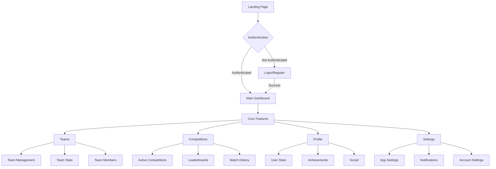
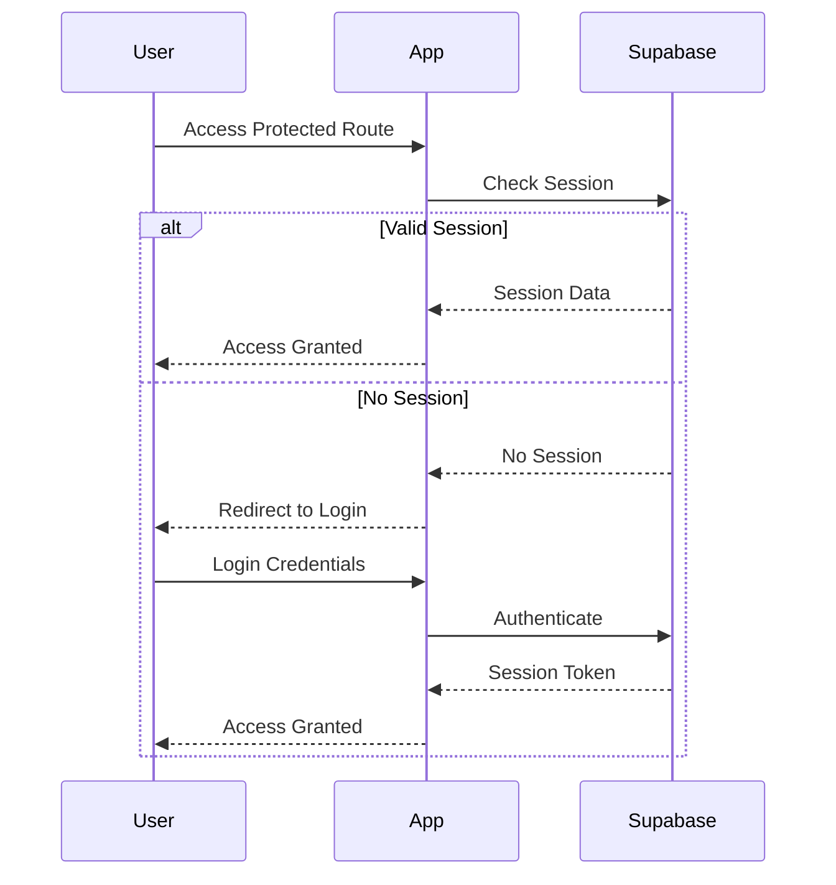
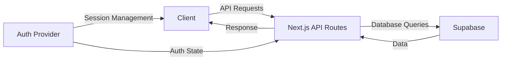

# Fantasy Pro Clubs App Architecture

## Application Flow



## Authentication Flow



## Directory Structure

```
app/
├── auth/           # Authentication related pages
├── dashboard/      # Main user dashboard
├── admin/          # Admin panel (protected)
├── api/           # API routes
├── components/    # Reusable components
├── settings/      # User settings
├── teams/         # Team management
├── competitions/  # Competition features
├── profile/       # User profile
└── [feature]/     # Other feature-specific routes
```

## Key Improvements

1. **Authentication Flow**
   - Implement consistent auth checks across routes
   - Add proper error handling for auth failures
   - Include password reset and email verification flows

2. **Route Protection**
   - Add middleware for protected routes
   - Implement role-based access control
   - Handle unauthorized access gracefully

3. **Error Handling**
   - Add global error boundary
   - Implement consistent error messages
   - Add proper logging

4. **Performance**
   - Implement proper loading states
   - Add data caching where appropriate
   - Optimize image loading and caching

5. **User Experience**
   - Add proper navigation breadcrumbs
   - Implement consistent loading indicators
   - Add proper feedback for user actions

## Data Flow



## Recommendations

1. Move from `/dashboard` to `/admin` for admin-specific features
2. Implement proper image optimization and CDN usage
3. Add proper error boundaries and fallback UI
4. Implement proper loading states for all async operations
5. Add proper type checking and validation
6. Implement proper testing strategy
7. Add proper monitoring and analytics
8. Implement proper CI/CD pipeline

## Next Steps

1. Fix current 404 errors for missing resources
2. Implement proper image handling with Next.js Image component
3. Add proper error handling for API routes
4. Implement proper loading states
5. Add proper testing coverage
6. Implement proper monitoring
7. Add proper documentation
8. Set up proper CI/CD pipeline 